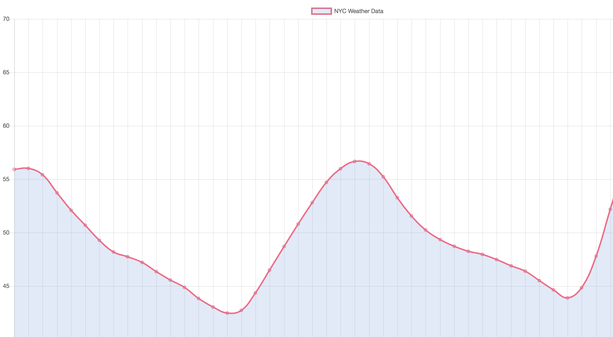

# Visualizing Temperature

## Objectives
* Build a page that uses data from the [Dark Sky](https://darksky.net/dev) to render a line chart using [Chart.js](http://www.chartjs.org/docs/latest/). It should look something like the picture below.



* Learn how to use `fetch` to keep data current.
* Use a JavaScript visualization library.

## Instructions
* Sign up for an account to generate a Dark Sky API Key [here](https://darksky.net/dev/register). You'll use this key for API calls.
* You'll be using [Chart.js](http://www.chartjs.org/) to visualize the JSON from Dark Sky so check it out. The `Chart.js` library is already linked in the head of your HTML file. Double check that the library is correctly linked by typing `Chart` into the browser's console. A function should be returned, not "undefined".
* Note that `script` tags for `weatherChart.js` and `init.js` are included in `index.html`.
* In `src/init.js`, assign the `API_KEY` variable to your Dark Sky API key.
* Also in `src/init.js`, the variable `URL` will be the URL that your code will use to fetch hourly JSON data on New York city's weather. This includes a CORS wrapper and a tag to just get hourly data. You can read the [docs](https://darksky.net/dev/docs) to get a sense of the exclude tags and read more about CORS [here](https://developer.mozilla.org/en-US/docs/Web/HTTP/CORS).
* Get the weather data using a [`fetch` request](https://developer.mozilla.org/en-US/docs/Web/API/Fetch_API/Using_Fetch). You can write your `fetch` inside the `makeRequest` function declared in `src/weatherChart.js`. Make sure to return the fetch!
* Associate each hour, in military time, with a temperature, in Fahrenheit.
* Use the data you found in the line above to make a line chart with Chart.js. Refer to its [line chart docs](http://www.chartjs.org/docs/#line-chart-example-usage) for help. Render the chart in the canvas with the id `NYCWeatherChart`.

### TIPS
* The time returned from the Dark Sky API will need to multiplied by 1000 in order to be used properly with JavaScript's Date Object. You will then need to turn the milliseconds into an hour time using JavaScript's Date object. For example:
```
let myDate = new Date(1532030796 * 1000)
myDate.getHours()
==> 16
```

* Chart.JS example to create a chart
```
var ctx = document.getElementById('myChart').getContext('2d');
var chart = new Chart(ctx, {
    // The type of chart we want to create
    type: 'line',

    // The data for our dataset
    data: {
        labels: ["January", "February", "March", "April", "May", "June", "July"],
        datasets: [{
            label: "My First dataset",
            data: [0, 10, 5, 2, 20, 30, 45],
        }]
    },

    // Configuration options go here
    options: {}
});
```

## Resources
* [Dark Sky Docs](https://darksky.net/dev/docs) - [Hourly Endpoint ](https://api.darksky.net/forecast/YOUR-API-KEY-HERE/40.7127,-74.0059?exclude=currently?exclude=minutely?exclude=daily')
* [fetch](https://developer.mozilla.org/en-US/docs/Web/API/Fetch_API/Using_Fetch)
* [Chart.js](http://www.chartjs.org/docs/latest/getting-started/) - [Line Charts](http://www.chartjs.org/docs/latest/charts/line.html)
